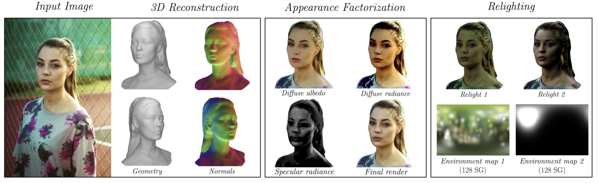
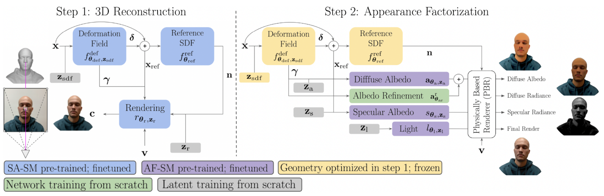
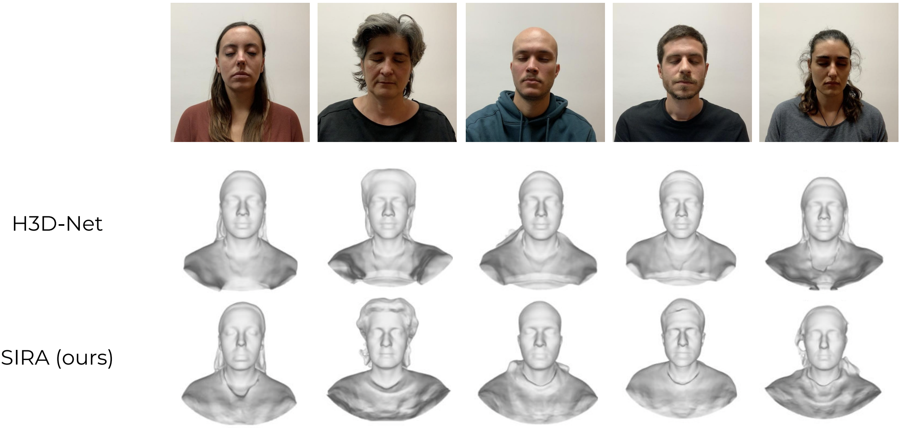

## Abstract

Recovering the geometry of a human head from a single image, while factorizing the materials and illumination, is a severely ill-posed problem that requires prior information to be solved. Methods based on 3D Morphable Models (3DMM), and their combination with differentiable renderers, have shown promising results. However, the expressiveness of 3DMMs is limited, and they typically yield oversmoothed and identity-agnostic 3D shapes limited to the face region. Highly accurate full head reconstructions have recently been obtained with neural fields that parameterize the geometry using multilayer perceptrons. The versatility of these representations has also proved effective for disentangling geometry, materials and lighting. However, these methods require several tens of input images. In this paper, we introduce SIRA, a method which, from a single image, reconstructs human head avatars with high fidelity geometry and factorized lights and surface materials. Our key ingredients are two data-driven statistical models based on neural fields that resolve the ambiguities of single-view 3D surface reconstruction and appearance factorization. Experiments show that SIRA obtains state of the art results in 3D head reconstruction while at the same time it successfully disentangles the global illumination, and the diffuse and specular albedos. Furthermore, our reconstructions are amenable to physically-based appearance editing and head model relighting.

## Method

We follow an analysis-by-synthesis approach to retrieve all the components of a relightable avatar from a single posed image with associated foreground mask, and camera parameters. The 3D geometry is represented as a signed distance function. To capture the complex appearance of human faces, we factor the surface radiance into a global illumination and spatially-varying diffuse and specular albedos, which we also implement as neural fields. Instead of using a single architecture to simultaneously optimize the geometry and appearance from scratch, we split the problem into a 3D reconstruction and an appearance factorization part. This two-step approach, similar to [NeRFactor](https://dl.acm.org/doi/abs/10.1145/3478513.3480496), allows us to adapt the training scheme to each of the two problems independently, and to introduce appropriate inductive biases. These are key to resolve the ambiguities that exist in single-view 3D reconstruction and appearance factorization.



## Results

We next evaluate our 3D reconstruction and appearance factorization on multiple real-world portrait photos from the datasets  [H3DS](https://openaccess.thecvf.com/content/ICCV2021/html/Ramon_H3D-Net_Few-Shot_High-Fidelity_3D_Head_Reconstruction_ICCV_2021_paper.html), 3DFAW.  We train the SA-SM and AF-SM priors on the dataset used in H3DS.

### 3D reconstruction results

The proposed method performs outperforms model-based methods like [Feng et al.](https://dl.acm.org/doi/abs/10.1145/3450626.3459936) and [Dib et al.](https://openaccess.thecvf.com/content/ICCV2021/html/Dib_Towards_High_Fidelity_Monocular_Face_Reconstruction_With_Rich_Reflectance_Using_ICCV_2021_paper.html) in 3D face reconstruction from only 1 view, and model-free approaches like [H3D-Net](https://openaccess.thecvf.com/content/ICCV2021/html/Ramon_H3D-Net_Few-Shot_High-Fidelity_3D_Head_Reconstruction_ICCV_2021_paper.html) in full head reconstruction.

SIRA recovers the geometry of the head, including hair and shoulders, yielding 3D shapes that clearly retain the identity of the person. Next, we show full head 3D reconstructions from a single input image.

<p align="center">
  
</p>

<p align="center">
  
  
</p>


### Appearance factorization results

We also provide a qualitative and quantitative comparison with respect to [IDR](https://arxiv.org/abs/2003.09852) varying the number of available views. Note how H3D-Net effectively finds realistic and detailed solutions in both few-shot and many-shot scenarios.

<p align="center">
  
</p>

## Related work

1. [DeepSDF: Learning Continuous Signed Distance Functions for Shape Representation (2019)](https://arxiv.org/abs/1901.05103)
2. [Implicit Geometric Regularization for Learning Shapes (2020)](https://arxiv.org/abs/2002.10099)
3. [Multiview Neural Surface Reconstruction with Implicit Lighting and Material (2020)](https://arxiv.org/abs/2003.09852)

## BibTeX

```
@article{caselles2022sira,
  title={SIRA: Relightable Avatars from a Single Image},
  author={Caselles, Pol and Ramon, Eduard and Garcia, Jaime and Giro-i-Nieto, Xavier and Moreno-Noguer, Francesc and Triginer, Gil},
  journal={arXiv preprint arXiv:2209.03027},
  year={2022}
}
```
